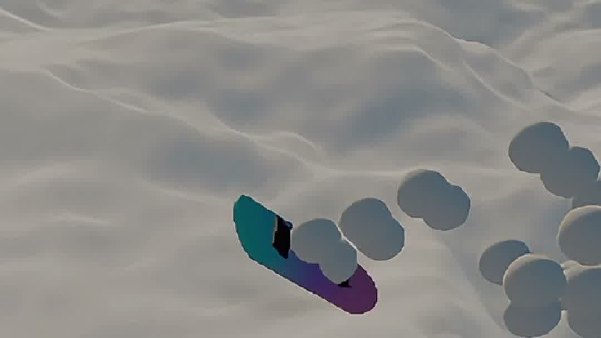

# shred ❄️



Imagine spending all summer thinking about snow. [Someone did](https://github.com/Noniv/snowflow_demo) — an ultra-realistic snow simulation, with a wizard walking around leaving footprints to prove it. Which raised the obvious question: **what if the finger skateboards were actually snowboards?** Put on a VR headset, touch your right index and middle fingertips together, and a fingerboard pops in riding your two fingers — exactly how a tech deck rides them. Sweep it through waist-high powder to start shredding, start carving, and have a little bit of the winter, *now*, in the summer.

**Try it:** [smrghsh.github.io/shred](https://smrghsh.github.io/shred/) — desktop gets a mouse fallback (left-drag to carve, right-drag to orbit). On Vision Pro, tap **Enter VR**: right-hand two-finger touch summons the board (spread them into a V to dismiss it), left-hand fist grabs the world to pull yourself around the mountainside.

## Why this is tricky

Three bleeding edges, stacked:

**WebGPU × WebXR on visionOS is barely a road yet.** WebXR-from-WebGPU only ships on visionOS 26 / Safari 26.2+, and three.js's native WebGPU XR path was broken outright in r185 — this runs on `three#dev` (r186) with a manual XR output pass that clamps visionOS's *logical* foveated viewports onto the physical XR texture, per-view, with MSAA off. A subtle trap that cost a night: XR `depthNear`/`depthFar` are **physical reference-space metres**, not world units — get it wrong and the near plane floats two real metres out, clipping your own hands into a head-locked hole.

**The snow is a GPU-resident compute sim.** A port of snowflow's trail system from a Babylon fragment-pass ping-pong to a raw WGSL compute pass: one rgba32float texture (1024² over the field) holds **depression** and **berm** as separate channels, so a trail reads as a carve-with-walls instead of a flat decal — trenches refill slower than berms slump. Per frame: Laplacian relaxation, mass-conserving slump, weathering, then brush splats. Carving writes a three-brush surf wake weighted by your lean, so the outside of a turn throws the heavier wall. The sim shares three's `GPUDevice`, so state reaches the snow material through one GPU→GPU copy per frame — zero CPU readback. Lighting is snowflow's too: a Nishita sky baked to an equirect LUT, projected to spherical harmonics, ground-bounce solved by iteration — one light shading the carve field, the dunes, and the raymarched far range alike.

**You are a giant.** The camera rig is scaled 60× and stood partway up the flank of a mountain, so the carve field becomes a whole mountainside under your fingertips. The OS never sees the trick — hand-joint positions arrive pre-scaled, so every physical gesture threshold (the 4.5 cm fingertip touch, the fist curl) has to be measured in *real* metres and multiplied back through the rig scale. The terrain mesh is a polar grid centered on the carve field: sub-metre triangles at your feet, 20 m triangles holding the crest's skyline 800 m out.

## Run it locally

```bash
npm install
npm run dev        # https on your LAN (WebXR needs a secure context)
NO_SSL=1 npx vite  # plain http, desktop-only testing without cert warnings
```

On the Vision Pro (visionOS 26 / Safari 26.2+): open `https://<your-mac-LAN-ip>:5173`, accept the self-signed certificate, tap **Enter VR**, and allow hand tracking when prompted. Dev consoles from the headset stream into `.dev-remote.log` next to the vite config, so you can `tail -f` a session without Web Inspector.

```bash
npm run build      # emits docs/ for GitHub Pages
```

Project structure follows the brahma convention: `Experience` singleton, `World/` scene objects, app code in `src/`, assets in `static/`, GitHub-Pages build in `docs/`.
